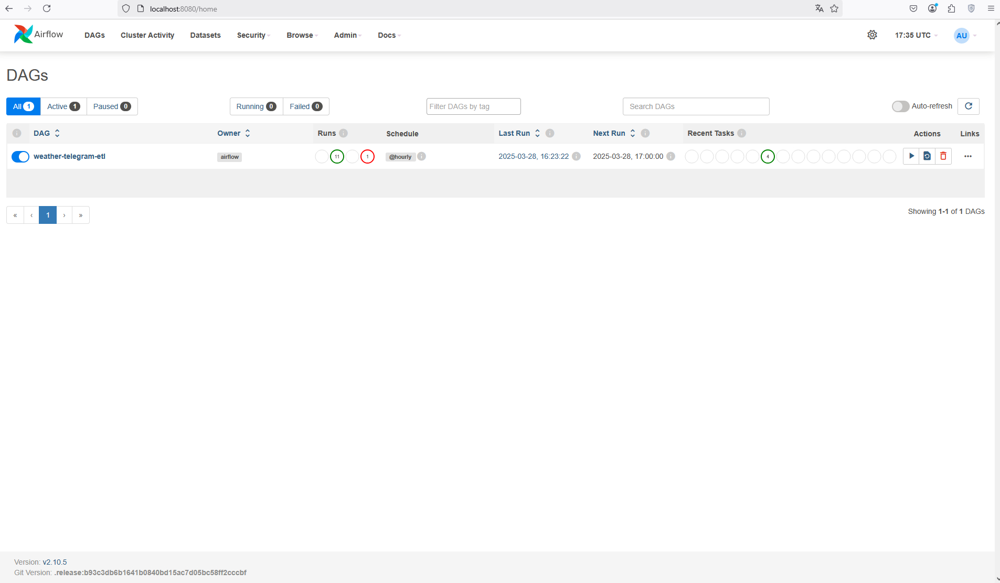
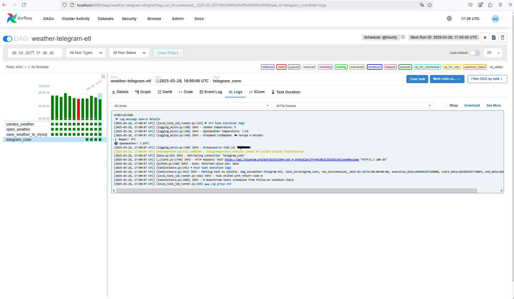
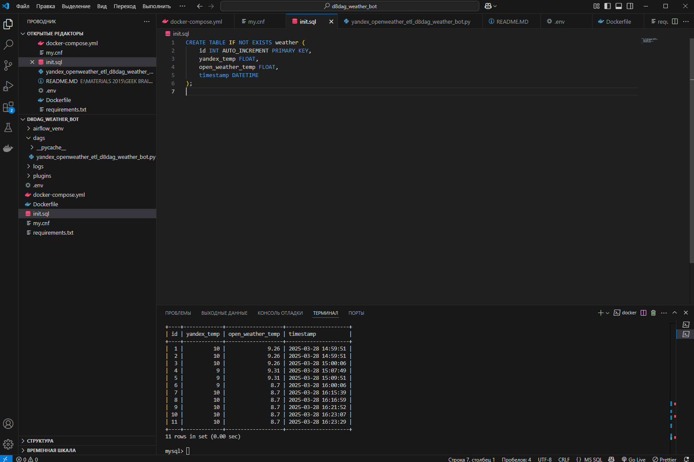
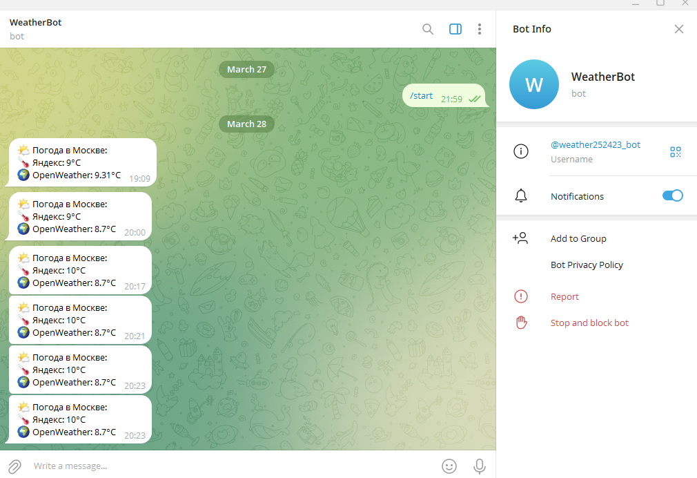
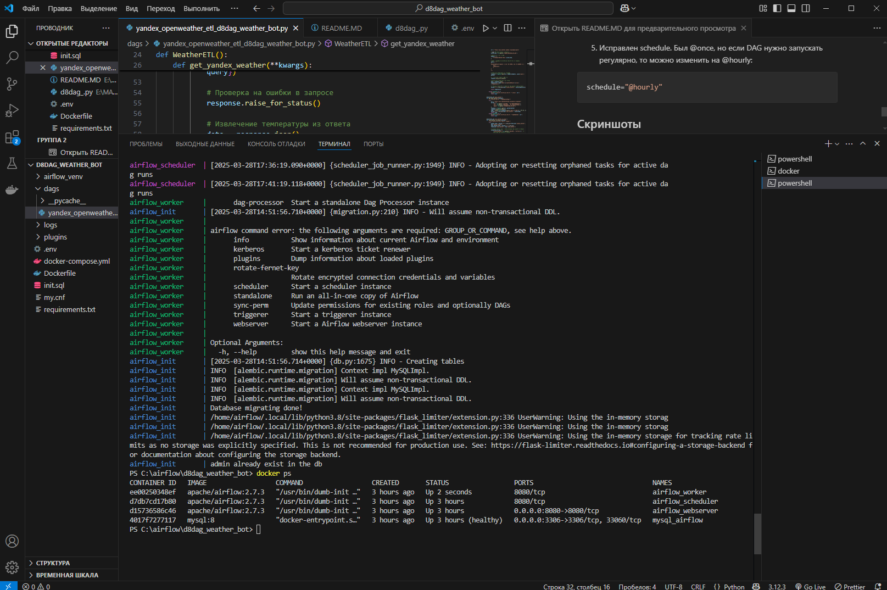

# Weather ETL Pipeline с Airflow и Telegram

## О проекте

ETL-пайплайн для автоматического сбора погодных данных из внешних API (Яндекс.Погода, OpenWeatherMap), сохранения в MySQL и отправки уведомлений в Telegram.

**Бизнес-ценность:** Готовое решение для сбора API-данных с оркестрацией, логированием и оповещениями. Может использоваться как основа для систем мониторинга, аналитики или ML-прогнозов.

Проект разворачивается в Docker: Airflow + MySQL. Данные о погоде записываются в БД с меткой времени, после чего отправляется уведомление в Telegram.

### 1. Архитектура

API Яндекс.Погоды ──┐
├── Airflow DAG ──► MySQL ──► Telegram
API OpenWeather  ───┘


## Технологический стек

| Компонент | Технология |
|-----------|------------|
| Оркестрация | Apache Airflow 2.7.3 |
| Исполнитель | CeleryExecutor |
| База данных | MySQL 8.0 |
| Контейнеризация | Docker + Docker Compose |
| Уведомления | Telegram Bot API |
| Язык | Python 3.8 |

## Возможности

- Сбор данных из нескольких источников одновременно
- Регулярный запуск по расписанию (настраивается в DAG)
- Сохранение истории с временными метками
- Мгновенные уведомления в Telegram
- Контейнеризация для лёгкого развёртывания
- Безопасное хранение ключей через .env
- Добавление данных (append), а не перезапись

## Быстрый старт

```bash
git clone <repo-url>
cd weather-etl-pipeline-telegram
docker-compose up --build -d


## **1. Структура проекта**

```plaintext

│── dags/                     # Папка с DAG-файлами Airflow
│   ├── yandex_openweather_etl_d8dag_weather_bot.py  # Основной DAG-файл
│── logs/                     # Логи Airflow
│── plugins/                  # Плагины Airflow
│── docker-compose.yml        # Файл конфигурации Docker Compose
│── Dockerfile                # Инструкция для сборки контейнера Airflow
│── .env                      # Переменные окружения
│── init.sql                  # SQL-скрипт для инициализации БД
│── my.cnf                    # Конфигурация MySQL
│── requirements.txt          # Зависимости Python
```

### 2. Контейнеризация

#### docker-compose.yml

В этом файле определены все сервисы, которые используются в проекте.

- Контейнер mysql (База данных)
  Запускает MySQL 8 с паролем и пользователем.

При старте инициализируется SQL-скриптом init.sql, который создает таблицу weather.

Открывает порт 3306 для взаимодействия с другими контейнерами.

Использует файл конфигурации my.cnf, где указано default-authentication-plugin=mysql_native_password, чтобы избежать проблем с подключением.

- Контейнер airflow-init
  Подготавливает базу данных для Airflow (airflow db migrate).

Создает пользователя admin для Airflow.

- Контейнер airflow-webserver
  Запускает Airflow Web UI (порт 8080).

Берет настройки базы данных из переменных окружения (AIRFLOW**DATABASE**SQL_ALCHEMY_CONN).

Загружает API-ключи для Telegram, Yandex и OpenWeather из .env.

- Контейнер airflow-scheduler
  Запускает планировщик задач для DAG-ов.

Работает в связке с airflow-webserver, ожидая выполнения DAG-ов.

- Контейнер airflow-worker
  Используется для выполнения задач DAG.

Включает поддержку CeleryExecutor, если проект масштабируется.

## 3. Файлы проекта

#### init.sql — инициализация базы данных
### Схема базы данных 

```sql
CREATE TABLE IF NOT EXISTS weather (
    id INT AUTO_INCREMENT PRIMARY KEY,
    yandex_temp FLOAT,
    open_weather_temp FLOAT,
    timestamp DATETIME
);
```

Создает таблицу weather в базе данных, куда записываются температуры.

#### my.cnf — конфигурация MySQL

```ini
[mysqld]
default-authentication-plugin=mysql_native_password
```

Указывает старый механизм аутентификации (mysql_native_password), чтобы Airflow мог подключаться к MySQL.

#### Dockerfile — настройка контейнера Airflow

```dockerfile
FROM apache/airflow:2.7.3-python3.8

USER root

# Устанавливаем системные зависимости

RUN apt-get update && \
    apt-get install -y --no-install-recommends \
    build-essential \
    default-libmysqlclient-dev \
    pkg-config \
    gcc \
    python3-dev \
    && rm -rf /var/lib/apt/lists/*

COPY requirements.txt /requirements.txt

USER airflow

# Обновляем pip и устанавливаем зависимости

RUN pip install --upgrade pip && \
    pip install --no-cache-dir \
    -r /requirements.txt
```

#### .env — переменные окружения

Файл .env содержит API-ключи, пароли и другие настройки. Это позволяет:

    - Не хранить секреты в коде

    - Использовать разные конфигурации на разных серверах

    - Безопасно делиться проектом (исключая .env из репозитория)

#### requirements.txt — управление зависимостями в Airflow

Все Python-пакеты фиксируются в requirements.txt и автоматически устанавливаются при сборке Docker-образа.

При сборке контейнера Docker запускается команда:

```bash
pip install -r requirements.txt
```

Airflow автоматически устанавливает все пакеты из списка, что упрощает развертывание.


## Мониторинг

    Airflow UI — статус задач, логи, история запусков

    MySQL — проверка качества данных

    Telegram — мгновенное подтверждение работы

## Развитие проекта

    Добавление новых API-источников

    Интеграция с облачными хранилищами (S3)

    Визуализация в Grafana или Streamlit

    ML-модели для прогнозирования

## Скриншоты

### Интерфейс Airflow с запущенным DAG



### Лог выполнения задачи



### Содержимое таблицы MySQL с погодными данными



### Сообщение в Telegram от бота



### Лог работы контейнеров Docker


